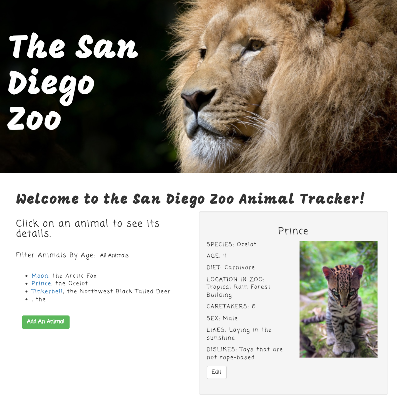

# _The San Diego Zoo_

#### _This is an application built with Angular2 and TypeScript for tracking animals at the San Diego Zoo! It is intended to be used by zoo employees to help them better care for the animals.  June 9, 2017_

#### By _**Asia Kane**_

## Description

Every zoo should have an easy-to-use application to help its employees track animals.  This helps to ensure the animals are cared for properly.  After all, the zoo is their home!  This app fulfills the following user stories:

As a user:

* I want to log a newly-admitted animal by submitting a form with animal species, name, age, diet, zoo location, number of needed caretakers, sex, one like and one dislike.
* I want to view a list of animals I have logged.
* I want options to view all animals, only young animals (less than 2 years of age), or only mature animals (more than 2 years of age).
* I want to click an animal to edit its species, name, age, diet, zoo location, number of needed caretakers, sex, one like and one dislike.

This app is written in Angular2 using TypeScript.  The application structure is outlined below.  

Models:
  - Animal (Properties: species, name, age, diet, zoo location, number of needed caretakers, sex, one like, one dislike)

Entry Point:
  - main.ts

Modules:
  - Root module (app.module.ts)

Components:
  - Root component (app.component.ts)
  - animal-list.component.ts
  - new-animal.component.ts
  - edit-animal.component.ts

## Prerequisites

You will need the following things properly installed on your computer.

* [Git](https://git-scm.com/)
* [Node.js](https://nodejs.org/) (with NPM)
* [TypeScript](https://www.typescriptlang.org/)
* [Angular2](https://angular.io/)

## Installation

In your terminal:
* `git clone https://github.com/akane0915/local-zoo`
* `cd zoo-app`
* `npm install`
* `npm install typescript`
* `apm install atom-typescript`
* `bower install`

## Running / Development

* `gulp build`
* `gulp serve` (http://localhost:3000).
* If you would like to make changes to this project, do so in the text editor.
* Make frequent commits with detailed comments.
* Submit changes as pull request to Asia at akane0915 on Github.

## Technologies Used

* Angular2
* TypeScript
* Node
* Bower
* Gulp
* HTML
* CSS
* Bootstrap https://getbootstrap.com/
* ES6

## Known Bugs
_N/A_

## Support and contact details
_I encourage you to update/make suggestions/refactor this code as you see fit. I am always open to improvement! Please contact Asia Kane at asialkane@gmail.com with questions._

  ### License
  *This software is licensed under the MIT license*
  Copyright © 2017 **Asia Kane**
